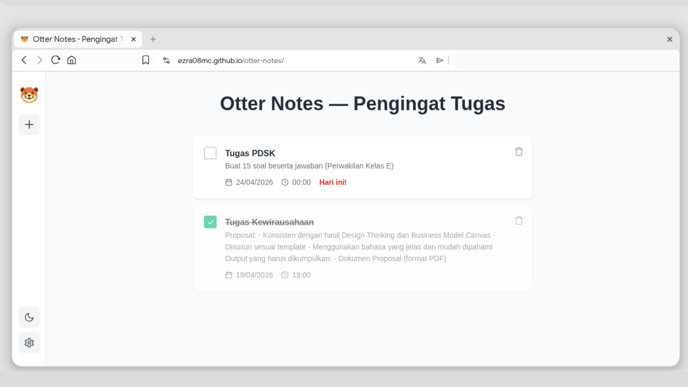

  
  
  <h1>Otter Notes</h1>
  <h3><b>Smart & Cloud-Synced Task Management</b></h3>  
  
A powerful, installable (PWA), and seamless web-based task assistant with Telegram integration.

  
  
  
  
  

## 🚀 Overview
[🔗 Visit Website](https://ezra08mc.github.io/otter-notes/)  
  
**Otter Notes** has evolved from a simple local task list into a comprehensive time management solution. Featuring **Cloud Synchronization**, an installable **PWA** experience, and a **Telegram Bot Assistant**, Otter Notes ensures you never miss a deadline again, whether you are on your browser or chatting on Telegram.

### 🎯 Project Goals
1. **Accessible Anywhere:** Seamless synchronization across all your devices via the cloud.
2. **Proactive Reminders:** Reducing late submissions through dual-channel notifications (Browser Push & Telegram).
3. **Intuitive & Modern:** Providing a sleek UI with zero learning curve, now powered by a highly comfortable Modern Slate Dark Mode.

## ✨ Key Features

- ☁️ **Cloud Sync & Account** — Secure login and real-time database syncing.
- 🤖 **Telegram Assistant** — Connect your ID to receive automated remote reminders and check upcoming tasks using the `/check` command directly in Telegram.
- 📱 **PWA Ready** — Install Otter Notes directly to your home screen (Mobile/Desktop) for a native app-like experience.
- 🗓️ **Interactive Calendar & Filters** — Easily view tasks by "Today", "Upcoming", "Overdue", or visualize them on the full Monthly Calendar.
- 🔔 **Dual Smart Notifications** — Accurate reminders delivered through local browser push notifications and serverless Telegram messages.
- 🌓 **Modern Dark Mode** — An elegant, aesthetic "Slate" dark theme for late-night productivity.
- 🗑️ **Safe Management** — Complete tasks instantly, or move them to the Trash bin where they can be restored or permanently deleted.

## 💡 Why Otter Notes?

| Advantage | Description |
| :--- | :--- |
| **Cross-Platform** | Access via browser, install as an app, or interact via Telegram Bot. |
| **Cloud Powered** | Safe and secure data storage with backend integration. |
| **Highly Automated** | Serverless Cron Jobs handle your background reminders accurately every minute. |
| **Flexible Tiers** | 100% Free for local device usage, with an exclusive Premium tier for full Cloud & Bot capabilities. |

## 👥 Target Audience

- 🎓 **University Students** — Manage complex course assignments and organizations seamlessly.
- 👨‍💻 **Professionals & Freelancers** — Keep track of project deadlines across multiple devices.
- 👤 **General Users** — Anyone who needs a reliable, highly-integrated personal assistant.

## 🛠️ Development & Tech Stack
Built with pure Web Technologies (Vanilla HTML, CSS, JavaScript) for maximum speed, backed by **Supabase** (PostgreSQL & Auth), **Cloudflare Workers** (Serverless Automation), and the **Telegram Bot API**.

